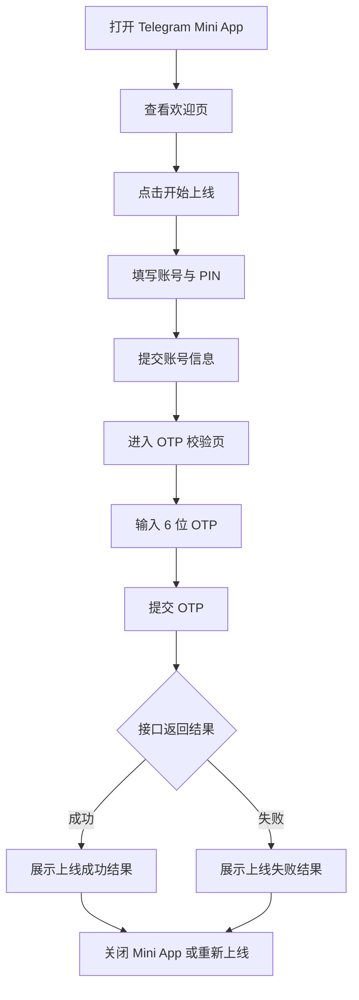

## 1. 产品概述
这是一个面向 Telegram 内嵌场景的手机卡直连上线 Mini App，帮助用户在聊天环境中完成账号提交、OTP 校验和上线结果确认。
- 目标用户是在 Telegram 中发起手机卡上线操作的终端用户，核心问题是减少扫码依赖，改为账号直连链路完成上线。
- 产品价值是缩短上线路径、降低操作门槛，并为后续接入真实 Telegram WebApp 能力与后端接口提供统一交互壳层。

## 2. 核心功能

### 2.1 功能模块
1. **欢迎页**：展示产品定位、链路说明和开始操作入口。
2. **账号提交页**：收集上线账号与 PIN，进行基础格式校验。
3. **OTP 校验页**：输入 6 位 OTP，支持重新发送验证码。
4. **结果页**：展示上线成功或失败状态，并提供关闭或重新发起操作。

### 2.2 页面详情
| 页面名称 | 模块名称 | 功能描述 |
|-----------|-------------|---------------------|
| 欢迎页 | 品牌头部 | 展示 Mini App 名称、状态提示和 Telegram 风格容器外观 |
| 欢迎页 | 流程摘要卡片 | 呈现“账号直连上线”链路说明，强调无扫码流程 |
| 账号提交页 | 账号输入框 | 输入上线账号，支持基础长度限制与自动保存 |
| 账号提交页 | PIN 输入框 | 输入 PIN，支持数字过滤、显隐切换与提交前校验 |
| OTP 校验页 | OTP 输入框 | 输入 6 位短信验证码，支持自动保存与输入格式限制 |
| OTP 校验页 | 二次操作区 | 提交 OTP 或重新发送 OTP |
| 结果页 | 状态反馈区 | 根据接口返回展示成功或失败状态文案 |
| 结果页 | 操作按钮区 | 支持关闭 Mini App、重新发起上线流程 |

## 3. 核心流程
用户从 Telegram 中打开 Mini App 后进入欢迎页，确认链路说明后开始上线。随后输入账号与 PIN，提交后进入 OTP 校验页。验证码通过校验后进入结果页；若接口返回错误，则展示失败状态并允许用户重试。

## 4. 用户界面设计
### 4.1 设计风格
- 主色使用 Telegram 蓝与浅青色辅助色，搭配高亮成功绿和风险红。
- 按钮采用大圆角高对比实心按钮，次级操作使用浅底描边按钮。
- 字体以系统中文字体栈为基础，标题偏紧凑、正文清晰易读，适配移动端小屏阅读。
- 布局采用单列卡片式移动界面，外层模拟手机壳体，内层保持 Telegram Mini App 沉浸式体验。
- 图标建议使用线性图标风格，保持轻量、清晰和强状态识别。

### 4.2 页面设计概览
| 页面名称 | 模块名称 | UI 元素 |
|-----------|-------------|-------------|
| 欢迎页 | 品牌区 | 顶部品牌标识、状态胶囊、浅渐变背景、流程卡片 |
| 账号提交页 | 表单区 | 带图标输入框、焦点高亮、PIN 显隐按钮、底部主操作按钮 |
| OTP 校验页 | 验证区 | 验证码输入框、说明文案、主次按钮组合、轻量反馈提示 |
| 结果页 | 状态区 | 成功或失败图形标记、结果标题、说明文案、关闭与重试按钮 |

### 4.3 响应式策略
- 采用桌面优先设计，同时确保核心体验面向移动端优化。
- 在桌面端保留手机壳预览结构，方便设计评审和联调演示。
- 在小屏设备下自动移除冗余外框，让内容铺满视口，优化触控区域和可读性。

### 4.4 Telegram Mini App 交互约束
- 打开时优先读取 Telegram WebApp 上下文，展示用户已进入 Telegram 内嵌环境的状态感。
- 关键按钮需预留接入 Telegram 主按钮、关闭能力和触觉反馈的扩展位。
- 草稿信息默认保存在本地，以降低误触关闭后的信息丢失风险。
