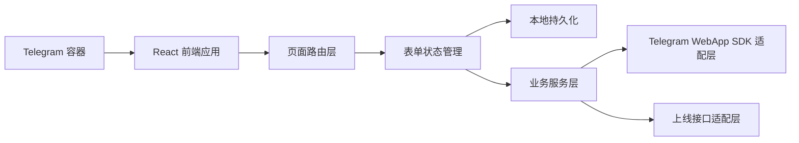
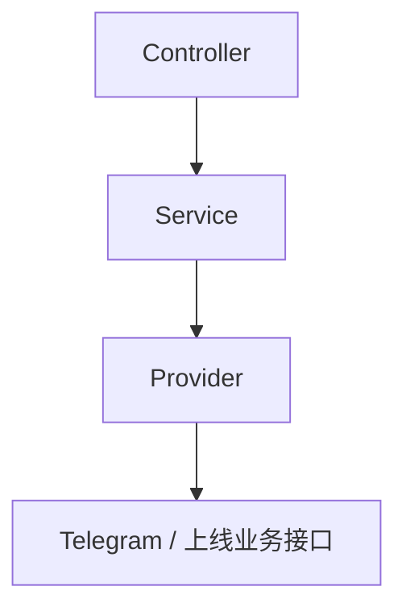
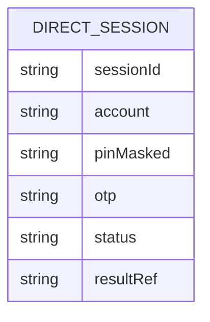

## 1. 架构设计


## 2. 技术说明
- 前端：React 18 + TypeScript + Vite + Tailwind CSS 3
- 状态管理：React Hooks + Context，保持轻量并适配单流程产品
- 路由：`react-router-dom`，覆盖欢迎页、提交页、OTP 页、结果页
- 表单处理：受控输入 + 本地校验逻辑 + `localStorage` 草稿持久化
- Telegram 集成：封装 Telegram WebApp SDK，统一处理主题、关闭、主按钮和触觉反馈
- 接口策略：首版可使用本地 mock 服务，后续替换为真实上线接口

## 3. 路由定义
| 路由 | 用途 |
|-------|---------|
| / | 欢迎页与流程入口 |
| /submit | 提交账号与 PIN |
| /otp | 输入并校验 OTP |
| /result | 展示上线结果 |

## 4. API 定义
首版以前端 mock 为主，但保留与真实服务对齐的接口结构。

```ts
type SubmitAccountRequest = {
  account: string;
  pin: string;
};

type SubmitAccountResponse = {
  requiresQrScan: boolean;
  flow: "direct";
  sessionId: string;
};

type VerifyOtpRequest = {
  sessionId: string;
  otp: string;
};

type VerifyOtpResponse = {
  success: boolean;
  resultRef: string;
  message?: string;
};
```

## 5. 服务端架构图
当前阶段不实现独立服务端，采用前端 mock 适配层模拟接口行为。后续若接入真实后端，可扩展为如下结构：



## 6. 数据模型
### 6.1 数据模型定义


### 6.2 数据定义说明
- `sessionId`：账号提交成功后返回的会话 ID，用于 OTP 校验。
- `account`：用户提交的上线账号。
- `pinMasked`：前端仅保存脱敏后的 PIN 状态，不在持久层保留明文。
- `otp`：本地暂存的 OTP 输入值，仅用于当前会话验证。
- `status`：流程状态，包含 `draft`、`otp_pending`、`success`、`failed`。
- `resultRef`：上线结果单号或引用编号，用于结果展示和后续追踪。
